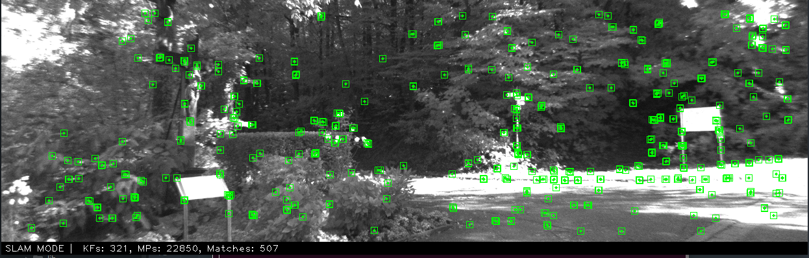
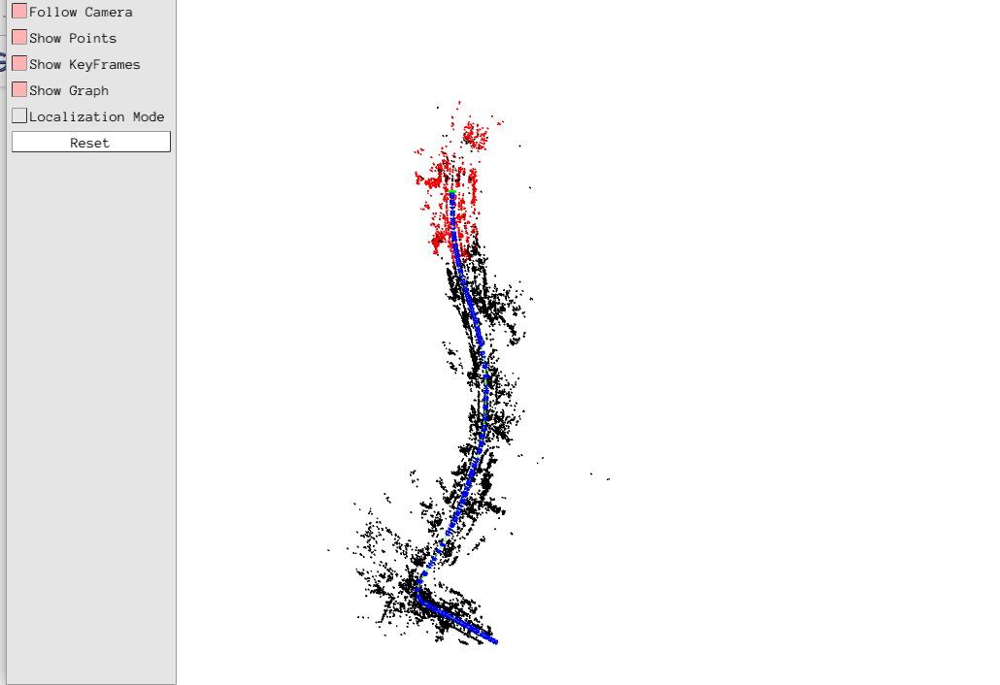

# Super-SLAM





## 1. License (inherited from ORB-SLAM2)

See LICENSE file. This repo is build on top of https://github.com/KinglittleQ/SuperPoint_SLAM with support for latest pytorch and c++14

### C++14
We use the new thread and chrono functionalities of C++14.

### Pangolin
We use [Pangolin](https://github.com/stevenlovegrove/Pangolin) for visualization and user interface. Dowload and install instructions can be found at: https://github.com/stevenlovegrove/Pangolin.

### OpenCV
We use [OpenCV](http://opencv.org) to manipulate images and features. Dowload and install instructions can be found at: http://opencv.org. **Required at least OpenCV 3**.

### Eigen3
Required by g2o (see below). Download and install instructions can be found at: http://eigen.tuxfamily.org. **Required at least 3.1.0**.

### DBoW3 and g2o (Included in Thirdparty folder)
We use modified versions of [DBoW3](https://github.com/rmsalinas/DBow3) (instead of DBoW2) library to perform place recognition and [g2o](https://github.com/RainerKuemmerle/g2o) library to perform non-linear optimizations. Both modified libraries (which are BSD) are included in the *Thirdparty* folder.

### G++ compiler 

Use G++-8 as default to build pytorch 

### Libtorch

We use Pytorch C++ API to implement SuperPoint model. It can be built with latest pytorch:

``` 
git clone --recursive https://github.com/pytorch/pytorch
cd pytorch && mkdir build && cd build
python ../tools/build_libtorch.py
```

It may take quite a long time to download and build. Please wait with patience.

**NOTE**: Do not use the pre-built package in the official website, it would cause some errors.

## 3. Building SuperPoint-SLAM library and run 

chmod +x build.sh
./build.sh

sh run.sh 

```


## 4. Download Vocabulary

You can download the vocabulary from [google drive](https://drive.google.com/file/d/1p1QEXTDYsbpid5ELp3IApQ8PGgm_vguC/view?usp=sharing) or [BaiduYun](https://pan.baidu.com/s/1fygQil78GpoPm0zoi6BMng) (code: de3g). And then put it into `Vocabulary` directory. The vocabulary was trained on [Bovisa_2008-09-01](http://www.rawseeds.org/rs/datasets/view//7) using DBoW3 library. Branching factor k and depth levels L are set to 5 and 10 respectively.
